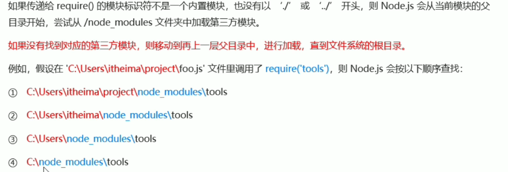

## Node.js学习记录
### npm与包

#### 什么是包

NOde.js中的第三方模块又叫做包

第三方模块和包是一个概念，只是叫法不同。

#### 为什么需要包

由于Node.js的内置模块仅提供一些底层的API，导致在基于内置模块进行项目开发时，效率很低。

包是基于内置模块封装出来的，提供了更高级、更方便的API，极大的提高了开发效率。

包和内置模块之间的关系，类似于jQuery和浏览器内置API之间的关系。

#### npm初体验

1. 格式化时间的传统做法

step:
* 创建格式化时间的自定义模块
* 定义格式化时间的方法
* 创建补零函数
* 从自定义模块中导出格式化时间的函数
* 导入时间格式化的自定义模块
* 调用格式化时间的函数

```js
function dataFormat(dtStr){
    const dt = new Date()

    const y = dt.getFullYear()
    const m = padZero(dt.getMonth() + 1) 
    const d = padZero(dt.getDate()) 

    const hh = padZero(dt.getHours()) 
    const mm = padZero(dt.getMinutes()) 
    const ss = padZero(dt.getSeconds()) 

    return `${y}-${m}-${d} ${hh}:${mm}:${ss} `
};

// 补零函数
function padZero(n){
    return n > 9 ? n : '0' + n
}

module.exports = {
    dataFormat
}
```

2. 格式化时间的高级做法

* 使用npm包管理工具，在项目中安装格式化时间的包moment
* 使用require()导入格式化时间的包
* 参考moment官方API文档对时间进行格式化
```js
const moment = require('moment')

const dt = moment().format('YYYY-MM-DD HH:mm:ss')

console.log(dt)
```

3. 包的语义化版本规范

包的版本号是以"点分十进制"形式进行定义的，总共有三位数字，例如2.24.0

其中每一位数字所代表的含义如下：
第1位数字：大版本
第2位数字：功能版本
第3位数字：Bug修复版本

版本号提升的规则：只要前面的版本号增长了，则后面的版本号归零。

#### 包管理配置文件

    npm规定，在项目根目录中，必须提供一个叫做package.json的包管理配置文件。用来记录与项目有关的一些配置信息。例如：
    * 项目的名称、版本号、描述等
    * 项目中都用到了哪些包
    * 哪些包只会在开发期间会用到
    * 那些包在开发和部署时都需要用到

1. 快速创建package.json

npm包管理工具提供了一个快捷命令，可以在执行命令时所处的目录中，快速创建package.json这个包管理配置文件：
```js
npm init -y 
```
注意：
* 上述命令只能在英文的目录下成功运行！所以，项目文件夹的名称一定要使用英文命名，不要使用中文，不能出现空格。
* 运行npm install 命令安装包的时候，npm 包管理工具会自动的把包名称和版本号  ，记录到package.json中。

2. dependencies节点

package.json文件中，有一个dependencies节点，专门用来记录您使用npm install 命令安装了哪些包


3. 卸载包

可以运行npm uninstall命令，来卸载指定的包

```js
npm uninstall moment
```

注意：npm uninstall 命令执行成功后，会把卸载的包，自动地从package.json的dependencies中移除掉。

4. devDependencies节点

    如果某些包只在项目开发阶段会用到，在项目上线之后不会用到，则建议把这些包记录到devDependencies节点中。
    与之对应的，如果某些包在开发阶段和项目上线之后都需要用到，则建议把这些包记录到dependencies节点中。

您可以使用如下的命令，将包记录到devDependencies节点中：
```js
npm i 包名 -D

npm install 包名 --save--dev
```

#### 解决下包速度慢的问题

1. 淘宝npm镜像服务器

慢的原因如图：


淘宝在国内搭建了一个服务器，专门把国外服务器上的包同步到国内的服务器，然后在国内提供下包的服务。从而极大的提供了下包的速度。


扩展：
镜像(Mirroring)是一种文件存储形式，一个磁盘上的数据在另一个磁盘上存在一个完全相同的副本即为镜像。

2. 切换npm的下包镜像源

下包的镜像源，指的就是下包的服务器地址。

```js
// 查看当前的下包镜像源
npm config get registry
// 将下包的镜像源切换为淘宝镜像源
npm config set registry = https://registry.npm.taobao.org/
// 检查镜像源是否下载成功
npm config get registry
```

3. nrm

为了更方便的切换下包的镜像源，我们可以安装nrm这个小工具，利用nrm提供的终端命令，可以快速查看和切换下包的镜像源

```js
// 通过npm包管理器，将nrm安装为全局可用的工具
npm i nrm -g
// 查看所有可用的镜像源
nrm ls
// 将下包的镜像源切换为taobao镜像
nrm use taobao
```

#### 包的分类

1. 项目包

那些被安装到项目的node_modules 目录中的包，都是项目包。

项目包又分为两类，分别是：

* 开发依赖包(被记录到devDependencies节点中的包，只会在开发期间会用到)
* 核心依赖包(被记录到dependencies节点中的，在开发期间和项目上线之后都会用到)

```js
npm i 包名 -D
npm i 包名
```

2. 全局包

在执行npm install命令时，如果提供了-g参数，则会把包安装为全局包。
全局包会被安装到C:\Users\用户目录\AppData\Roaming\npm\node_modules目录下。
```js
npm i 包名-g
npm uninstall 包名 -g 
```
注意：
* 只有工具性质的包，才有全局安装的必要性。因为它们提供了好用的终端命令。
* 判断某个包是否需要全局安装后才能使用，可以参考官方提供的使用说明即可。

3. i5ting_toc

i5ting_toc是一个可以把md文档转为html 页面的小工具，使用步骤如下：
```js
npm i -g i5ting_toc

// 调用i5ting_toc ，轻松实现md转为html的功能
i5ting_toc -f 要转换的md文件路径 -o
```

#### 规范的包结构

    包的内部结构
一个规范的包，它的组成结构，必须符合以下3点要求：
1. 包必须以单独的目录而存在
2. 包的顶级目录下要必须包含package.json这个包管理配置文件
3. package.json中必须包含name、version、main这三个属性，分别代表包的名字、版本号、包的入口

    注意：以上3点要求是一个规范的包结构必须遵守的格式，关于更多的约束，可以参考如下网址：
    https://yarnpkg.com/zh-Hans/docs/package-json

#### 开发属于自己的包

1. 初始化包的基本结构

* 新建lCoder-tools文件夹，作为包的根目录
* 在lCoder-tools文件夹中，新建如下三个文件：
    · package.json (包管理配置文件)
    · index.js (包的入口文件)
    · README.md (包的说明文档)

2. 初始化package.json
```json
{
    "name": "lCoder-tools",
    "version": "1.0.0",
    "main": "index.js",
    "description": "提供了格式化时间、HTMLEscape相关的功能",
    "keywords": [
        "lCoder",
        "dateFormat",
        "escape"],
    "license": "ISC"
}
```

3. 在index.js中定义格式化时间的方法

4. 在index.js中定义转义html的方法

5. 在index.js中定义还原html的方法
   
6. 将不同的功能进行模块化拆分

* 将格式化时间的功能，拆分到src -> dateFormat.js 中
* 将处理HTML字符串的功能，拆分到src -> htmlEscape.js中
* 在index.js中，导入两个模块，得到需要向外共享的方法
* 在index.js中，使用module.exports把对应的方法共享出去                                     

7. 编写包的说明文档

包根目录中的README.md文件，是包的使用说明文档。

一般内容：
安装方式、导入方式、功能介绍、开源协议

#### 发布包

1. 注册npm账号

2. 登录npm账号
在本地登录npm login

注意：在运行npm login命令之前，必须先把下包的服务器地址切换为npm的官方服务。否则会导致发布包的失败

3. 把包发布到Npm上

在终端切换的包的根目录之后，运行npm publish 命令，即可将包发布到npm上(注意：包名不能雷同)

4. 删除已发布的包

运行npm unpublish 包名 --force 命令，即可从npm删除已发布的包

注意：
* npm unpublish 命令只能删除72小时之内发布的包
* npm unpublish 删除的包，在24小时之内不允许重复发布


### 模块的加载机制

1. 优先从缓存中加载

模块在第一次加载后会被缓存。这也意味着多次调用require()不会导致模块的代码被执行多次。

注意：不论是内置模块、用户自定义模块、还是第三方模块，它们都会优先从缓存加载，从而提高模块的加载效率

2. 内置模块的加载机制
   
内置模块是由Node.js官方提供的模块，内置模块的加载优先级最高。

例如：```js require('fs')```始终返回内置的fs模块，即使在node_modules目录下有名字相同的包也叫fs

3. 自定义模块的加载机制

    使用require()加载自定义模块时，必须指定以./或../开头的路径标识符。在没有指定./或../这样的路径标识符时，则node会把它当作内置模块或第三方模块进行加载。

同时，在使用require()导入自定义模块时，如果省略了文件的扩展名，则Node.js会按顺序分别尝试加载以下的文件：
* 按照确切的文件名进行加载
* 补全.js扩展名进行加载
* 补全.json扩展名进行加载
* 补全.node扩展名进行加载
* 加载失败，终端报错

4. 第三方模块的加载机制



5. 以目录作为模块

目录作为模块标识符，传递给require()进行加载的时候，有三种加载方式：

