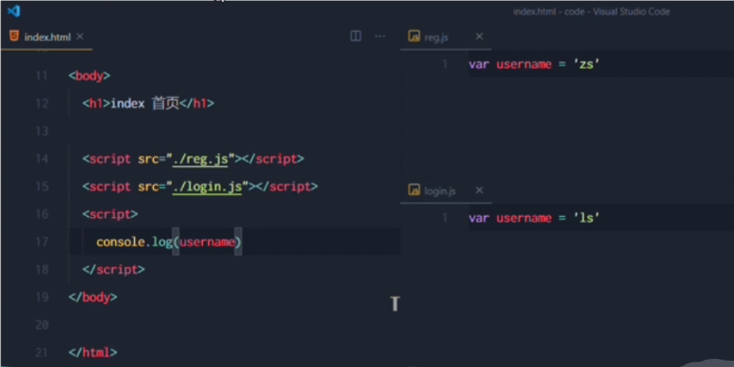
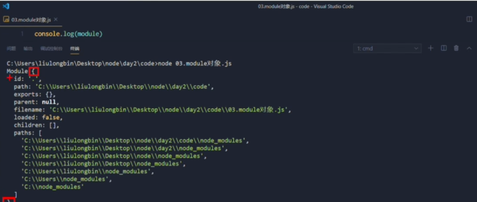

## Node.js学习记录

### http模块

#### 什么是客户端、什么是服务器

在网络节点中，负责消费资源的电脑，叫做客户端；负责对外提供网络资源的电脑，叫做服务器。

<span style="color: red">http模块</span>是Node.js官方提供的、用来<span style="color: red">创建Web服务器</span>的模块。通过http模块提供的<span style="color: skyblue">http.createServer()方法</span>，就能方便的把一台普通的电脑，变成一台Web服务器，从而对外提供Web资源服务。

如果要希望使用http模块创建Web服务器，则需要先导入它：

```js
const http = require('http')
```

#### 进一步理解http模块的作用

服务器和普通电脑的<span style="color: red">区别</span>在于，服务器上安装了Web服务器软件，例如：IIS、Apache等。通过安装这些服务器软件，就能把一台普通的电脑变成一台Web服务器。

在Node.js中，我们<span style="color: skyblue">不需要使用</span>IIS、Apache等这些第三方Web服务器软件。因为我们可以基于Node.js提供的http模块，<span style="color: red">通过几行简单的代码，就能轻松的手写一个服务器软件</span>，从而对外提供Web服务。

#### 服务器相关的概念

1. IP地址

<span style="color: red">IP地址</span>就是互联网上<span style="color: red">每一台计算机的唯一地址</span>，因此IP地址具有唯一性。如果把"个人电脑"比作"一台电话"，那么"IP地址"就相当于"电话号码"，只有在知道对方的IP地址的前提下，才能与对应的电脑之间进行数据通信。

IP地址的格式：通常用"点分十进制"表示成(a,b,c,d)的形式，其中，a-d都是0-255之间的十进制整数。例如：用点分十进表示的IP地址(192.168.1.1)

注意：

1. 互联网中每台Web服务器，都有自己的IP地址，例如：可以在Win终端中运行 ping www.baidu.com命令，即可查到百度服务器的IP地址。
2. 在开发期间，自己的电脑既是一台服务器，也是一个客户端，为了方便测试，可以在自己的浏览器中输入127.0.0.1这个IP地址，就能把自己的电脑当作服务器来访问了。

2. 域名和域名服务器

域名就是字符型的地址方案，即所谓的域名地址(Domain Name)

IP地址和域名是一一对应的关系，这份对应关系存放在一种叫做服务器(DNS, Domain name server)的电脑中。使用者只需通过好记的域名访问对应的服务器即可，对应的转换工作由域名服务器实现。因此，域名服务器就是提供IP地址和域名之间的转换服务的服务器。

注意：
1. 单纯使用IP地址，互联网中的电脑也能正常工作。有域名，能让它更方便。
2. 在开发测试期间，127.0.0.1对应的域名是localhost，他们都代表我们自己的电脑，在使用效果上没有任何区别。

3. 端口号

一台电脑中，可以运行成百上千个Web服务。每个Web服务器都对应一个唯一的端口号。客户端发送过来的网络请求，通过端口号，可以被准确地交给对应的Web服务进行处理。

注意：
1. 每个端口号不能同时被多个Web服务占用。
2. 在实际应用中，URL中的80端口可以被省略

#### 创建基本的web服务器
Step:
1. 导入http模块
```js
const http = require('http')
```
2. 调用http.createServer()方法

```js
const server = http.createServer()
```

3. 为服务器实例绑定request事件，即可监听客户端发送过来的网络请求：
```js
server.on('request', (req,res) => {
   // 只要有客户端来请求我们自己的服务器，就会触发request事件，从而调用这个事件处理函数
   console.log('Someone visit our web server')
})
```

4. 启动服务器

调用服务器实例的.listen()方法，即可启动当前的Web服务器实例：
```js
// 调用 server.listen(端口号，cb回调)方法，即可启动Web服务器
server.listen(80, ()=>{
   console.log('http server running at http://127.0.0.1')
})
```

5. req请求对象

只要服务器接收到了客户端的请求，就会调用通过server.on()为服务器绑定的request事件处理函数。如果想在事件处理函数中，访问与客户端相关的数据或属性，可以使用如下的方式：
```js
server.on('request',(req)=>{
    //req 是请求对象
    const str = 'Your request url is ${req.url} , and request method is ${req.method}'
    console.log(str)
})
```

6. res响应对象

在服务器的request事件处理函数中，如果想访问与服务器相关的数据或者属性，可以使用如下方式：
```js
server.on('request', (req,res)=>{
    // res是响应对象，它包含了与服务器相关的数据和属性，例如：
    // 要发送到客户端的字符串
    const str = `Your request url is ${req.url},and request method is ${req.method}`
    // req.end()方法的作用：
    // 向客户端发送指定的内容，并结束这次请求的处理过程
    res.end(str)
})
```

7. 解决中文乱码的问题

当调用res.end()方法，向客户端发送中文内容的时候，会出现乱码问题，此时，需要手动设置内容的编码格式：
```js
server.on('request',(req, res)=>{
    const str = `您请求的url地址是 ${req.url}, 请求的method是${req.method}`

    // 调用res.setHeader()方法，设置Content-Type响应头，解决中文乱码的问题
    res.setHeader('Content-Type', 'text/html; charset=utf-8')

    res.end(str)
})
```

#### 根据不同的url响应不同的html内容

1. 核心实现步骤：

 获取请求的url地址
 设置默认的响应内容为404 Not found
 判断用户请求的是否为 / 或 /index.html首页
 判断用户请求的是否为 /about.html 关于页面
 设置Content-Type响应头，防止中午乱码
 使用res.end()把内容响应给客户端
   
2. 动态响应内容：

```js
server.on('request', function(req, res) {
    const url = req.url

    let content = '<h1> 404 Not found</h1>'
    
    if(url === '/' || url === '/index.html') {
        content = '<h1>首页</h1>'

    }else if(url === '/about.html'){
        content = '<h1>关于页面</h1>'
    }
    res.setHeader('Content-Type', 'text/html; charset=utf-8')
    res.end(content)
})
```

### 模块化的基本概念

#### 什么是模块化

    模块化是指解决一个复杂问题时，自顶向下逐层把系统划分成若干模块的过程。对于整个系统来说，模块是可组合、分解和更换的单元。

编程领域中的模块化，就是遵守固定的规则，摆一个大文件拆成独立并互相依赖的多个小模块。

把代码进行模块化拆分的好处：

1. 提高了代码的复用性
2. 提高了代码的可维护性
3. 可以实现按需加载

#### 模块化规范

模块化规范就是对代码进行模块化的拆分与组合时，需要遵守的那些规则。

例如：

* 使用什么样的语法格式来引用模块
* 在模块中使用什么样的语法格式向外暴露成员

模块化规范的好处：大家都遵守同样的模块化规范写代码，降低了沟通的成本，极大方便了各个模块之间的相互调用，利人利己。

### Node.js中的模块化

#### Node.js中模块的分类

Node.js中根据模块来源的不同，将模块分为了3大类，分别是：
* 内置模块(内置模块是由Node.js官方提供的，例如fs、path、http等)
* 自定义模块(用户创建的每个.js文件，都是自定义模块)
* 第三方模块(由第三方开发出来的模块，并非官方提供的内置模块，也不是用户创建的自定义模块，使用前需要先下载 )

#### 加载模块

使用强大的require()方法，可以加在需要的内置模块、用户自定义模块、第三方模块进行使用。例如：

```js
// 加载内置fs模块
const fs = require('fs')

// 加载用户自定义模块
const custom = require('./custom.js')

// 加载第三方模块(关于第三方模块的下载和使用，会在后面的课程中进行专门的讲解)
const moment = require('moment')
```

注意：使用require()方法加载其他模块时，会执行被加载模块中的代码

#### Node.js中的模块作用域

1. 什么是模块作用域

和函数作用域类似，在自定义模块中定义的变量、方法等成员，只能在当前模块内被访问，这种模块级别的访问限制，叫做模块作用域。

2. 模块作用域的好处

防止了全局变量污染的问题



#### 向外共享模块作用域中的成员

1. module对象

在每个.js自定义模块中都有一个module对象，它里面存储了和当前模块有关的信息，打印如下：


2. module.exports对象

在自定义模块中，可以使用module.exports对象，将模块内的成员共享出去，供外界使用。
外界用require()方法导入自定义模块时，得到的即使module.exports所指的对象

3. 共享成员时的注意点

使用require()方法导入模块时，导入的结果，永远以module.exports指向的对象为准。

4. exports对象

默认情况下，exports和module.exports指向同一个对象。最终共享的结果，还是以module.exports结果为准。

#### Node.js中的模块化规范

    Node.js遵循了CommonJS模块化规范，CommonJS规定了模块的特性和各模块之间如何相互依赖。

CommonJS规定：

1. 每个模块内部，module变量代表当前模块。
2. module变量是一个对象，它的exports属性(即module.exports)是对外接口。
3. 加载某个模块，其实是加载该模块的module.exports属性。require()方法用于加载模块

