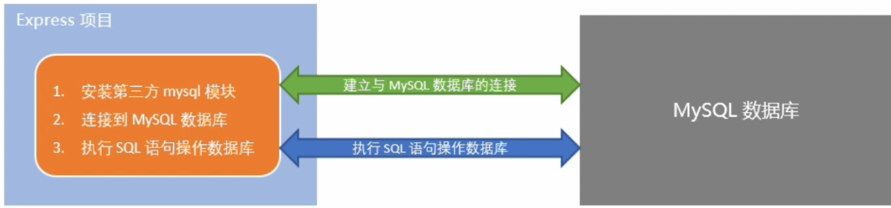

## Express学习记录
### 在项目中操作MYSQL

#### 在项目中操作数据库的步骤

1. 安装Mysql数据库的第三方模块(mysql)
2. 通过mysql模块连接到Mysql数据库
3. 通过mysql模块执行SQL语句



#### 安装与配置mysql模块

1. 安装mysql模块

```js
npm install mysql
```

2. 配置mysql模块

```js
const mysql = require('mysql')

const db = mysql.createPool({
    host: '127.0.0.1:3306',  // 数据库的IP
    user: 'root',
    password: '123123',
    database: '数据库名称'
})
```

3. 测试mysql模块能否正常工作

调用db.query()函数，指定要执行的SQL语句，通过回调函数拿到执行的结果：
```js
db.query('sql语句', (err, results) => {
    if(err) return console.log(err.message)

    console.log(results)
})
```

#### 使用MYSQL模块操作Mysql数据库

1. 查询数据

```js
const sqlStr = 'select * from users'

db.query(sqlStr, (err, results) => {
    if(err) console.log(err.message)
    console.log(results)
})
```

2. 插入数据

向users表中新增数据，其中username为Spider Man, password为pcc321 

```js
const user = { username: 'Spider-Man', password: 'pc312'}

const sqlStr2 = 'insert into users (username,password) values (?,?)'

db.query(sqlStr2, [user.username, user.password], (err,results)=>{
    if(err) return console.log(err.message)
    if(results.affectedRows === 1) console.log('插入数据成功')
})
```

3. 插入数据的便捷方式

    向表中新增数据时，如果数据对象的每个属性和数据表的字段一一对应，则可以通过如下方式快速插入数据：

```js
const user = { username: 'Spider-Man2', password: 'pc1232'}

const sqlStr3 = 'INSERT INTO users SET ?'

db.query(sqlStr3, user, (err,results)=>{
    if(err) return console.log(err.message)
    if(results.affectedRows === 1) console.log('插入数据成功')
})
```

4. 更新数据

```js
const user = {id: 5,username: 'aaa', password: '000'}

const sqlStr4 = 'UPDATE users SET username=?, password=? WHERE id= ?'

db.query(sqlStr4, [user.username, user.password, user.id], (err, results)=>{
    if(err) return console.log(err.message)
    if(results.affectedRows === 1){ console.log('更新数据成功！')}
});
```

5. 更新数据的便捷方式

```js
const user = {id: 5,username: 'qqq', password: '111'}

const sqlStr5 = 'UPDATE users SET ? WHERE id= ?'

db.query(sqlStr5, [user, user.id], (err, results)=>{
    if(err) return console.log(err.message)
    if(results.affectedRows === 1){ console.log('更新数据成功！')}
});
```

6. 删除数据

```js
const sqlStr6 = 'delete from users where id =? '

// 调用db.query() 执行sql语句 的同时，为占位符指具体值
/*
    如果SQL语句中有多个占位符，则必须使用数组为每个占位符指定具体的值
    如果SQL语句中只有一个占位符，则可以省略数组
*/ 
db.query(sqlStr6, 5, (err, results)=>{
    if(err) {return console.log(err.message)}
    if(results.affectedRows === 1 ){ console.log('删除数据成功')}
})
```

7. 标记删除

使用delete语句，会真正的把数据从表中删除。为了保险期间，推荐使用标记删除的方式，来模拟删除的动作

    所谓标记删除，就是在表中设置类似status这样的状态字段，来标记当前这条数据是否被删除

    当用户执行了删除的动作时，我们并没有执行DELETE语句把数据删除掉，而是执行了UPDATE语句，将这条数据对应的status字段标记为删除即可。

```js
db.query('update users set status = ? where id=? ',[1,4], (err,results)=>{
    if(err) {return console.log(err.message)}
    if(results.affectedRows === 1) {console.log('标记删除数据成功')}
})

```