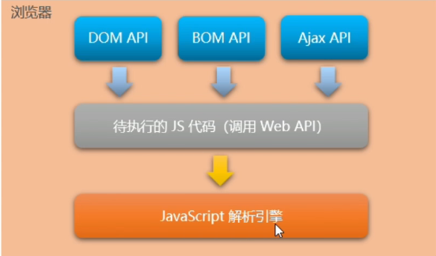
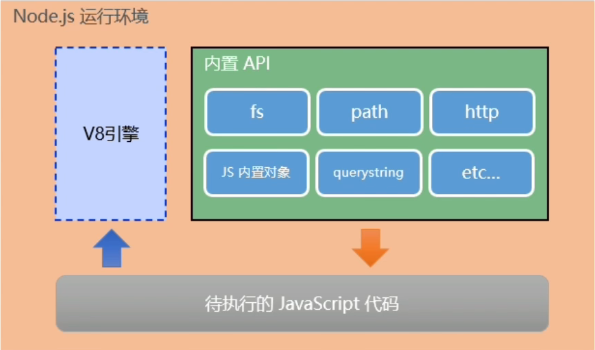

## Node.js学习记录

### 浏览器中的JavaScript的组成部分

1. JS核心语法
- 变量、数据类型
- 循环、分支、判断
- 函数、作用域、this
- etc(面向对象等)
2. WebAPI
- DOM操作
- BOM操作
- 基于XMLHttpRequest的Ajax操作
- etc
  
### 为什么JavaScript可以在浏览器中被执行


不同的浏览器使用不同的JavaScript解析引擎：
- Chrome浏览器 => V8
- Firefox浏览器 => OdinMonkey  --奥丁猴
- Safri浏览器 => JSCore
- IE浏览器 => Chakra  --查克拉
- etc

其中，Chrome 浏览器的V8解析引擎最好！

### 为什么JavaScript可以操纵DOM和BOM



### 浏览器中的JavaScript运行环境


总结：
1. V8引擎负责解析和执行JavaScript代码
2. 内置API是由<span style="color: red">运行环境</span>提供的特殊接口，<span style="color: rgb(234, 28, 32)">只能在所属的运行环境中被调用</span>

### 什么是Node.js

    Node.js是一个基于Chorome V8引擎的JavaScript运行环境

### Node.js的js运行环境



注意：
1. 浏览器是JavaScript的前端运行环境。
2. Node.js是JavaScript的后端运行环境。
3. Node.js中级工无法调用DOM和BOM等浏览器内置API

### Node.js可以做什么

1. 基于EXpress框架(http://www.expressjs.com.cn/), 可以快速构建Web应用
2. 基于Electron框架(https://electronjs.org/), 可以构建跨平台的桌面应用
3. 基于restify框架(http://restify.com/), 可以快速构建API接口项目
4. 读写和操作数据库、创建使用的命令行工具辅助前端开发、etc...

### fs文件系统模块

#### 什么是fs文件系统模块

<span style="color: red">fs模块</span>是Node.js官方提供的、用来操作文件的模块。它提供了一系列的方法和属性，用来满足用户对文件的操作需求。

eg：
1. fs.readFile()方法，用来读取指定文件中的内容
2. fs.writeFile()方法，用来向指定的文件中写入内容

如果要在JavaScript代码中，使用fs模块来操作文件，则需要使用如下的方式先导入它：

``` js
const fs = require('fs')
```

#### 读取指定文件中的内容

1. fs.readFile()的语法格式
使用fs.readFile()方法，可以读取指定文件中的内容，语法格式如下：
```js
fs.readFile(path[, options], callback)
```
参数解读：
- 必选参数(path), 字符串, 表示文件的路径。
- 可选参数(options), 表示以什么编码格式来读取文件。
- 必选参数(callback), 文件读取完成后, 通过回调函数拿到读取的结果。

2. fs.readFile()的示例代码
```js
const fs = require('fs')

fs.readFile(path, 'utf8', function(err, dataStr){
    if(err) return console.log('读取文件失败', err.message)

    console.log('读取成功', dataStr)
})
```

#### 向指定的文件中写入内容

##### fs.writeFile()的格式

使用fs.writeFile()方法，可以向指定的文件中写入内容，语法格式如下：

```js
fs.writeFile(file, data[, options], callback)
```

参数解读：
- 必选参数(file), 需要指定一个文件路径的字符串，表示文件的存放路径。
- 必选参数(data), 表示要写入的内容, 
- 可选参数(options), 表示以什么编码格式来读取文件。
- 必选参数(callback), 文件写入完成后的回调函数

注意点：
1. fs.writeFile()方法只能用来创建文件，不能用来创建路径
2. 重复调用fs.writeFile() 写入同一个文件，新写入的内容会覆盖之前的旧内容

#### fs路径动态拼接的问题

在使用fs模块操作文件时，如果提供的操作路径是以./或../开头的<span style="color: red">相对路径</span>时，很容易出现路径动态拼接错误的问题。

1. 原因：代码在运行时，<span style="color: red">会以执行node命令时所处的目录</span>,动态拼接出被操作文件的完整路径。

2. 解决方案：

<b>方案1：提供一个完整的文件存放路径(绝对路径)</b>

缺点：移植性非常差、不利于维护

<b>方案2：__dirname + '相对文件路径'</b>

### path路径模块

#### 概念

path模块时Node.js官方提供的、用来处理路径的模块。它提供了一系列的方法和属性吗，用来满足用户对路径的处理需求。

eg:

1. path.join()方法，用来将多个路径片段拼接成一个完整的路径字符串
2. path.basename()方法，用来从路径字符串中，将文件名解析出来

同理要先导入
```js
const path = require('path')
```

#### 路径拼接

1. path,join的语法格式

使用path.join()方法，可以把多个路径拼接成完整的路径字符串，语法格式如下：
```js
path.join([...paths])
```

参数解读：

· ...paths 字符串 路径片段的序列
· 返回值：字符串

eg:
```js
const pathStr = path.join('/a', '/b/c', '../'. './d', 'e')
console.log(pathStr)  // 输出  \a\b\d\e

const pathStr2 = path.join(__dirname, './files/1.txt)
console.log(pathStr2)
```

注意：<span style="color: red">今后凡是涉及到路径拼接的操作，都要使用path.join()方法处理</span>。不要直接使用+进行字符串的拼接 
原因：eg： fs.readFile(path.join(__dirname + './files/1.txt')) 可以屏蔽掉. 然后+不行。

#### 获取路径中的文件名

1. path.basename()的语法格式

使用path.basename()方法，可以从一个文件路径中，获取到文件的名称部分：

```js
const fpath = '/a'
```

#### 获取路径中的文件扩展名

1. path.extname()的语法格式

使用path.extname()方法，可以获取路径中的扩展名部分：

```js
const fpath = '/a/b/c/index.html/' 

const fext = path.extname(fpath)

console.log(fext)  //  输出 .html
```
