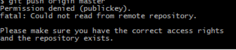

## push中遇到的常见问题1
    遇到的报错：
    fatal: Could not read from remote repository.

### 问题描述

    在push今天的博客更新内容时，遇到了以下错误

### 问题原因

    太久没用cmd登录GitHub上传博客，原本保存的缓存账号信息失效，需要重新更新GitHub仓库链接地址

### 解决方法

    重新关联仓库地址git remote set-url origin + 仓库地址