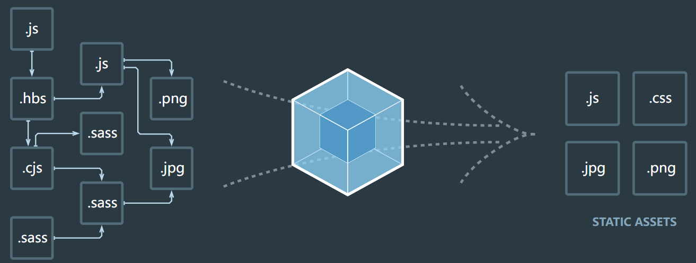

## WebPack 到底是什么

### 官方解释

    webpack is a static module bundler for modern JavaScript applications

### 解释拆解

- 打包bundler: webpack会帮助我们打包，所以它是一个打包工具
- 静态的static: 这样表述的原因是我们最终可以将代码打包成最终的静态资源(部署到服务器)
- 模块化module: webpack默认支持各种模块化开发，ES Module、CommonJS、AMD等
- 现代的module: 我们前端说过，正是因为现代前端开发面临各种问题，


### Vue项目加载的文件有哪些？

1. JavaScript的打包：
   * 将ES6转换成ES5的语法
   * TypeScript的处理，将其转换为JavaScript

2. CSS的处理
   * CSS文件模块的加载、提取
   * Less、Sass等预处理器的处理

3. 资源文件img、font
   * 图片img文件的加载
   * 字体font文件的加载

4. HTML资源的处理
   * 打包HTML资源文件

5. 处理Vue项目的SFC 文件.vue文件；

### Webpack的依赖图

* webpack到底是如何对我们的项目进行打包的呢？
 - 事实上webpack在处理应用程序的时候，它会根据命令或者配置文件找到入口文件;
 - 从入口开始，会生成一个依赖关系图，这个依赖关系图会包含应用程序中所需的所有模块(比如.js文件，.css文件，图片、 字体等)、
 - 然后遍历图结构，打包一个个模块(根据文件的不同使用不同的loader来解析); 


### 认识postcss工具

1. PostCSS是一个通过JavaScript来转换样式的工具;
2. 这个工具可以帮助我们进行一些CSS的转环和适配，比如自动添加浏览器的前缀、css样式的重置
3. 但是实现这个功能，我们需要借助于PostCSS对应的插件

### 命令行使用postcss

1. 安装postcsss

```
npm install postcss postcss-cli -D
```

2. 我们编写一个需要添加前缀的css
   * https://autoprefixer.github.io/
   * 我们可以在上面的网站中查询一些添加css属性的样式

### 插件autoprefixer

1. 安装
```
npm install autoprefixer -D
```

2. 直接使用postcss工具、并且制定使用autoprefixer

```
npx postcss --use autoprefixer -o demo.css '要进行添加前缀的css路径'
```

### postcss-loader

1. 安装

```
npm install postcss-loader -D
```

2. 我们修改加载css的loader：（配置文件已经过多，给出一部分了）
 - 注意：因为postcss需要有对应的插件才会起效果，所以我们需要配置它的plugin

```js
{
    loader : "postcss-loader",
    options : {
        postcssOptions : {
            plugins: [
                require('autoprefixer ')
            ]
        }
    }
}
```

### 单独的postcss配置文件

1. 在根目录下新建postcss-loader.config.js

```js
module.exports = {
    plugins : [
        require("autoprefixer")
    ]
}
```

### postcss-preset-env

* 事实上，在配置postcss-loader时，我们配置插件并不需要使用autoprefixer
* 我们可以使用另外一个插件：postcss-preset-env
  - postcss-preset-env也是一个postcss的插件；
  - 它可以帮助我们将一些现代的CSS特性，转成大多数浏览器认识的CSS，并且会根据目标浏览器或者运行时环境添加所需的polyfill
  - 也包括会自动帮助我们添加autoprefixer（所以相当于已经内置了autoprefixer）

1. 安装

```
npm install postcss-preset-env -D
```

2. 之后，在config.js文件中进行修改

```js
plugins : [
    require("postcss-preset-env")
]
```

* 注意：我们在使用某些postcss插件时，也可以直接传入字符串

```js
module.exports = {
    plugins : [
        "postcss-preset-env"
    ]
}
```