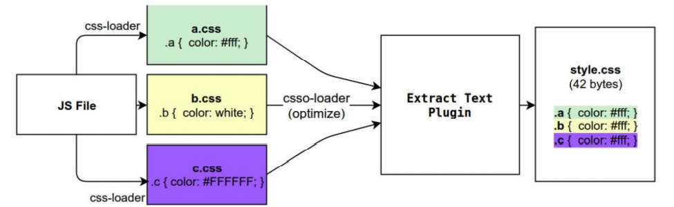
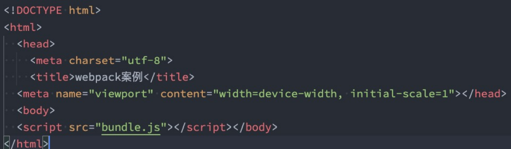
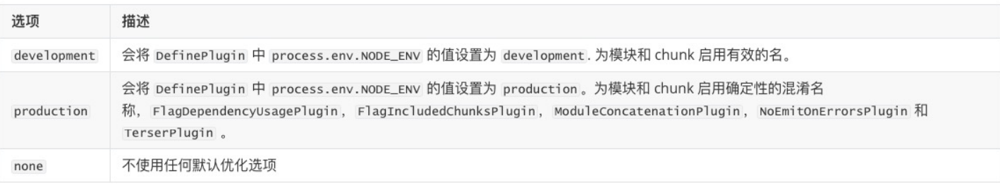
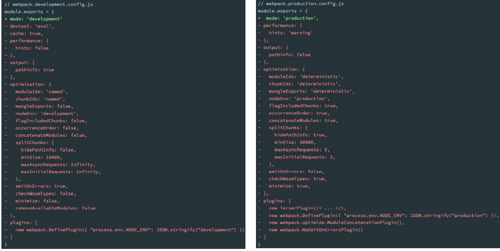

## WebPack打包其他资源和插件的使用

### 认识asset module type

* 我们当前使用的webpack版本是webpack5：
- p在webpack5之前，加载这些资源我们需要使用一些loader，比如raw-loader 、url-loader、file-loader；
- p在webpack5开始，我们可以直接使用资源模块类型（asset module type），来替代上面的这些loader

* 资源模块类型(asset module type)，通过添加 4 种新的模块类型，来替换所有这些 loader：
- asset/resource 发送一个单独的文件并导出 URL。之前通过使用 file-loader 实现；
- passet/inline 导出一个资源的 data URI。之前通过使用 url-loader 实现；
- passet/source 导出资源的源代码。之前通过使用 raw-loader 实现；
- passet 在导出一个 data URI 和发送一个单独的文件之间自动选择。之前通过使用 url-loader，并且配置资源体
积限制实现；

### asset module type的使用

* 比如加载图片, 我们可以使用下面的方式
```js
{
    test: /\.(png|svg|jpe?g|gif)$/i,
    type: "asset/resource"
},
```
* 如果你还需要自定义文件的输出路径和文件名
- 修改output，添加assetModuleFilename属性
- 在Rule中，添加一个generator属性，并且设置filename；

```js
output : {
    filename : "js/bundle.js",
    path : path.resolve(__dirname, "./dist"),
    assetModuleFilename : "img/[name].[hash:6][ext]"
}
```

```js
test : /\.(png|svg|jpe?g|gif)$/i,
type : "asset/resource",
generator : {
    filename : "img/[name].[hash:6][ext]"
}
```

### 实现url-loader的limit效果

1. 将type修改成asset，
2. 添加一个parser属性，并且制定dataUrl的条件，添加maxSize属性;

```js
rules : [
    {
        test : /\.(png|svg|jpe?g|gif)$/i,
        type : "asset",
        generator : {
            filename : "img/[name].[hash:6][ext]"
        },
        parser : {
            dataUrlCondition : {
                maxSize : 100 * 1024
            }
        }
    }
]

```

### 加载字体文件

* 在component中引入，并且添加一个i元素用于显示字体图标
```js
const iEl = document.createElement('i')
iEl.className = 'iconfont icon-ashbin';
element.appendChild(iEl)
```

### 字体的打包

* 使用file-loader来处理，也可以直接使用webpack5的资源模块类型来处理(更推荐后者)
- file-loader做法：
```js
{
    test : /\.(woff2?|eot|ttf)$/,
    type : 'asset/resource',
    generator : {
        filename : "font/[name].[hash:6][ext]"
    }
}
```

- webpack5的资源模块做法：

```js
{
    test : /\.(eot|ttf|woff2?)$/,
    type : "asset/resource",
    generator : {
        filename : "font/[name]_[hash:6][ext]"
    }
}
```

### 认识plugin

* Plugin可以用于执行更加广泛的任务，比如打包优化、资源管理、环境变量注入等



### CleanWebpackPlugin

* 重新打包时，会自动删除dist文件夹，重新生成新的打包文件

- 安装
```sh
npm install clean-webpack-plugin -D
```

- 在插件中配置
```js
const { CleanWebpackPlugin} = require('clean-webpack-plugin');
module.exports = {
    plugins : [
        new CleanWebpackPlugin()
    ]
}
```

### HtmlWebpackPlugin

* 另外还有一个不太规范的地方：
- HTML文件是编写在根目录下的，而最终打包的dist文件夹中是没有index.html文件的。
- 在进行项目部署的时，必然也是需要有对应的入口文件index.html；
- 所以也需要对index.html进行打包处理

* 对HTML进行打包处理我们可以使用另外一个插件：HtmlWebpackPlugin；

- 安装

```sh
npm install html-webpack-plugin -D
```

```js
const HtmlWebpackPlugin = require('html-webpack-plugin');
module.exports = {
    plugins : [
        new HtmlWebpackPlugin({
            title : "Webpack案例"
        })
    ]
}
```

* 对生成的index.html进行分析



* 这个文件是如何生成的呢？
- 默认情况下是根据ejs的一个模板来生成的；
- 在html-webpack-plugin的源码中，有一个default_index.ejs模块；

### 自定义html模板

* 如果我们想在自己的模块中加入一些比较特别的内容：
- 比如添加一个noscript标签，在用户的JavaScript被关闭时，给予响应的提示；
- 比如在开发vue或者react项目时，我们需要一个可以挂载后续组件的根标签```html <div id="app"></div>```

* 这个就是属于个人的模板
```html
<!DOCTYPE html>
<html lang="">
  <head>
    <meta charset="utf-8">
    <meta http-equiv="X-UA-Compatible" content="IE=edge">
    <meta name="viewport" content="width=device-width,initial-scale=1.0">
    <link rel="icon" href="./favicon.ico">
    <title>你好</title>
  <script defer src="js/bundle.js"></script></head>
  <body>
    <noscript>
      <strong>We're sorry but 你好 doesn't work properly without JavaScript enabled. Please enable it to continue.</strong>
    </noscript>
    <div id="app"></div>
    <!-- built files will be auto injected -->
  </body>
</html>
```

### 自定义模块的数据填充

* 上面的代码中，会有一些类似这样的语法<% 变量 %>，这个是EJS模块填充数据的方式。

* 在配置HtmlWebpackPlugin时，我们可以添加如下配置：
- template：指定我们要使用的模块所在的路径；
- title：在进行htmlWebpackPlugin.options.title读取时，就会读到该信息

```js
const HtmlWebpackPlugin = require('html-webpack-plugin');
module.exports = {
    plugins : [
        new HtmlWebpackPlugin({
            // 传入的是options对象
            template : "./public/index.html",
            title : "Webpack案例"
        })
    ]
}
```

### DefinePlugin的介绍

* 但是，这个时候编译还是会报错，因为在我们的模块中还使用到一个BASE_URL的常量：


* 这是因为在编译template模块时，有一个BASE_URL：
- ```html <link rel="icon" href="<%= BASE_URL %>favicon.ico">；```
- 但是我们并没有设置过这个常量值，所以会出现没有定义的错误；
* 这个时候我们可以使用DefinePlugin插件

### DefinePlugin的使用

* DefinePlugin允许在编译时创建配置的全局常量，是一个webpack内置的插件（不需要单独安装）：

```js
new DefinePlugin({
    BASE_URL : "'./'"
}),
```

### CopyWebpackPlugin

* 在vue的打包过程中，如果我们将一些文件放到public的目录下，那么这个目录会被复制到dist文件夹中。
- 这个复制的功能，我们可以使用CopyWebpackPlugin来完成
* 安装CopyWebpackPlugin插件：
```sh
npm install copy-webpack-plugin -D
```

* 接下来配置CopyWebpackPlugin即可：
- 复制的规则在patterns中设置；
- from：设置从哪一个源中开始复制；
- to：复制到的位置，可以省略，会默认复制到打包的目录下；
- globOptions：设置一些额外的选项，其中可以编写需要忽略的文件：
  .DS_Store：mac目录下回自动生成的一个文件；
  index.html：也不需要复制，因为我们已经通过HtmlWebpackPlugin完成了index.html的生成

```js
new CopyWebpackPlugin({
    patterns : [
        {
            from : "public",
            // to : "build", 有默认的读取   它会与path进行拼接
            to : "./",
            globOptions : {
                ignore : [
                    "**/index.html"
                ]
            }
        },
    ]
})
```

### Mode配置

* 前面我们一直没有讲mode。
- Mode配置选项，可以告知webpack使用响应模式的内置优化：
- 默认值是production（什么都不设置的情况下）；
- 可选值有：'none' | 'development' | 'production'；
* 这几个选项有什么样的区别呢


### Mode配置代表更多

